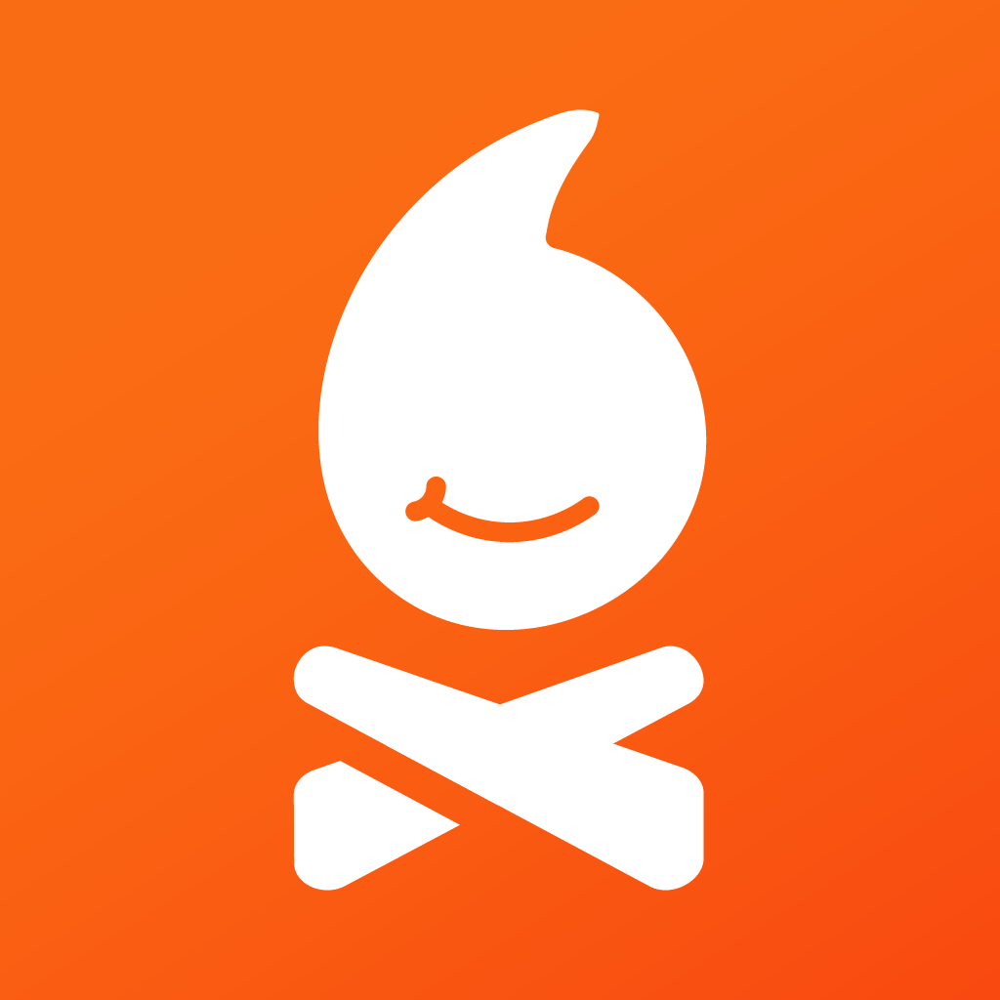

#   Emit

A mobile app for making it easier to catch up with friends spontaneously.

No design docs here; you'll know where to find those if you're supposed to.

Oh and also, if you're using VS Code (I hope you are, haha!), take a look at the recommended extensions in the `.vscode` folder.
